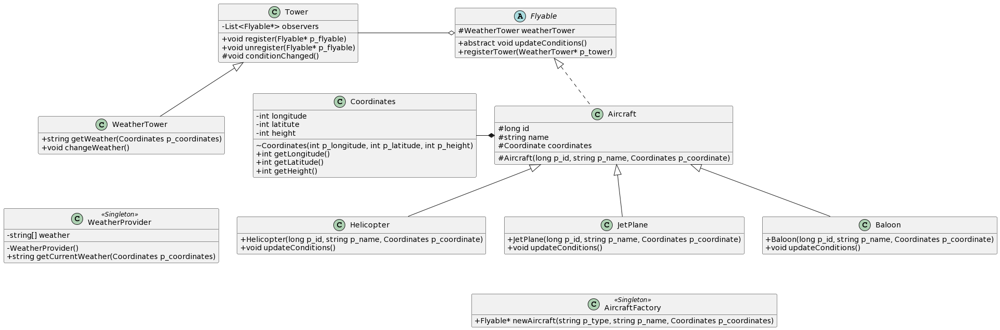

# Avaj-Launcher

### What is Avaj-Launcher?
It is the first project in a series of 3 projects with a focus on Java.

The goal of this project is to implement an aircraft simulation program based on a UML class diagram provided.
focused on promoting high-quality, easily maintainable and scalable code. The project serves as an introduction to writing robust code and applying the Design Patterns: Observer, Singleton and Factory.

### UML Diagran



#### Skills
- Rigor
- Adaptation & creativity
- Imperative programming
- Object-oriented programming

## Getting started
**Follow the steps below**
```bash
# Requirements: JDK 
# To install it, open the terminal window and write

curl -LO https://download.oracle.com/java/22/latest/jdk-22_linux-x64_bin.tar.gz

tar zxvf jdk-22_linux-x64_bin.tar.gz

rm -rf jdk-22_linux-x64_bin.tar.gz

export PATH="$HOME/jdk-22.0.1/bin:$PATH"

# Clone the project and access the folder
git clone https://github.com/Scaramovistk/Avaj-Launcher.git && cd Avaj-Launcher/

# Run make to compile it
make

# Clean output objects with
make clean

# Clean every side files
make fclean

# Well done!
```
---

Made by:
Gabriel Scaramal 👋
